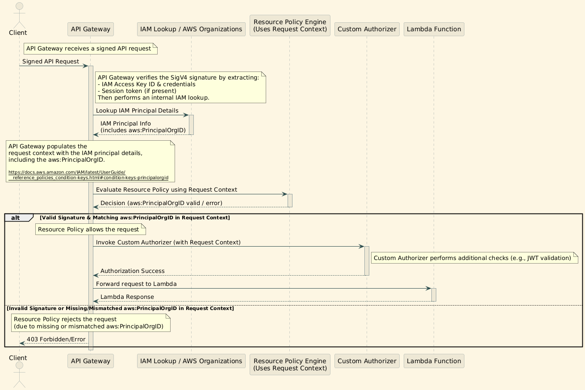

# Technical Note: Restricting API Gateway Access Using `aws:PrincipalOrgID` in a Resource Policy

## Table of Contents
- [1. Solution Overview](#1-solution-overview)
- [2. API Gateway Resource Policy](#2-api-gateway-resource-policy)
- [3. Example: AWS Lambda Function Calling API Gateway (Using `got`)](#3-example-aws-lambda-function-calling-api-gateway-using-got)
- [4. Expected Behavior in Different Scenarios](#4-expected-behavior-in-different-scenarios)
- [5. Summary of Authorization Behavior](#5-summary-of-authorization-behavior)
- [6. Key Takeaways](#6-key-takeaways)
- [Appendix: Debugging `aws:PrincipalOrgID` with a Hono-Based AWS Lambda Function](#appendix-debugging-awsprincipalorgid-with-a-hono-based-aws-lambda-function)

## 1. Solution Overview
This guide explains how to enhance security in AWS API Gateway by using a resource policy that restricts access to AWS accounts within your organization while still using a custom Lambda authorizer.

The key mechanism is the `aws:PrincipalOrgID` condition, which ensures that only requests originating from IAM‑authenticated principals in your AWS Organization can invoke the API. In this setup, **all API requests must be signed using AWS Signature Version 4 (SigV4)**—whether they come from a Lambda function, awscurl, or any other client.

### **Key Aspects**

- **Requires AWS Signature Version 4 (SigV4):** Every request must be signed with valid IAM credentials. This is critical because it ensures that API Gateway receives the necessary identity information.
- **Automatic inclusion of `aws:PrincipalOrgID`:** Once the request is verified, AWS automatically includes the caller’s Organization ID in the request context, which the resource policy uses.
- **No hardcoded credentials in Lambda:** Lambda functions use their execution role’s temporary IAM credentials to sign requests.
- **Rejects public, unauthenticated requests:** If a request isn’t signed (for example, if sent directly from Postman without proper SigV4 signing), it won’t include the `aws:PrincipalOrgID` and will be denied.

## 2. API Gateway Resource Policy
The following resource policy allows only IAM‑authenticated requests coming from AWS accounts within your organization:

```json
{
    "Version": "2012-10-17",
    "Statement": [
        {
            "Sid": "AllowOnlyOrgAccounts",
            "Effect": "Allow",
            "Principal": "*",
            "Action": "execute-api:Invoke",
            "Resource": "arn:aws:execute-api:eu-west-1:123456789012:abcdef1234/*",
            "Condition": {
                "StringEquals": {
                    "aws:PrincipalOrgID": "o-xxxxxxxxxx"
                }
            }
        }
    ]
}
```

### How It Works
- ✅ **Allows API calls only from IAM‑authenticated entities**: The request must be signed with valid credentials, ensuring that AWS can determine the caller’s organization.
- ❌ **Denies unauthenticated requests**: A request that isn’t signed (for example, a plain Postman call) will not include the required organization ID and will be rejected.
- ❌ **Denies requests from outside the organization**: Even if signed, requests from accounts not in the specified organization won’t include the matching `aws:PrincipalOrgID`.

---

## 3. Example: AWS Lambda Function Calling API Gateway (Using `got`)
The following Node.js Lambda function calls the protected API Gateway with a signed request.

### Lambda Function
```javascript
const got = require('got');
const AWS = require('aws-sdk');
const aws4 = require('aws4');

const API_HOST = "your-api-id.execute-api.eu-west-1.amazonaws.com";
const API_PATH = "/your-endpoint";
const API_REGION = "eu-west-1";

async function callApiGateway() {
    // Retrieve temporary IAM credentials from Lambda's execution role
    const credentials = await new AWS.CredentialProviderChain().resolvePromise();

    // Prepare request options for SigV4 signing
    const requestOptions = {
        host: API_HOST,
        path: API_PATH,
        service: "execute-api",
        region: API_REGION,
        method: "GET",
        headers: { "Content-Type": "application/json" }
    };

    // Sign the request with AWS SigV4 using the temporary credentials
    aws4.sign(requestOptions, credentials);

    // Make the API call using got with the signed headers
    const response = await got(`https://${API_HOST}${API_PATH}`, {
        method: requestOptions.method,
        headers: requestOptions.headers
    });

    console.log("API Response:", response.body);
}

callApiGateway();
```

### How Does This Work Without Explicit IAM Keys?
- **Automatic Credential Provisioning:**  
  AWS Lambda automatically provides temporary IAM credentials through its execution role. These credentials are used by the `aws4` library to generate a valid SigV4 signature—no hardcoded keys are needed.
  
### How Does API Gateway Validate the Request?
- **Local Signature Verification:**  
  API Gateway verifies the SigV4 signature locally. It checks that the signature is valid and, as part of that process, confirms the identity of the IAM principal.
  
- **Inference of Organization ID:**  
  Once the signature is verified, AWS determines the caller’s Organization ID (via metadata associated with the IAM credentials) and makes it available to the resource policy. API Gateway then enforces the policy: if the `aws:PrincipalOrgID` matches the allowed organization, the request proceeds; otherwise, it is rejected.
  
- **No Round-Trip to STS for Each Request:**  
  Contrary to some oversimplified explanations, API Gateway does not make an explicit call to AWS STS for every request. Instead, it relies on local signature verification to ensure the request’s authenticity.



### Comparing a Signed Request to an Ordinary API Call (e.g., via Postman)
- **Signed Request (e.g., from Lambda or awscurl):**  
  When a request is properly signed using AWS SigV4, it carries the necessary IAM credentials. API Gateway verifies the signature, extracts the caller’s Organization ID, and, if it matches the resource policy’s condition, allows the request—even if a custom Lambda authorizer is also in use.

- **Ordinary API Call (e.g., via Postman):**  
  A request sent without SigV4 signing (as typical in Postman unless you’ve set up AWS authentication) will not include the IAM credentials or the inferred `aws:PrincipalOrgID`. Even if your API uses a custom authorizer to validate tokens or other credentials, the resource policy is enforced at the API Gateway level. This means that **all API requests must be signed**; otherwise, they will be rejected before reaching your custom authorizer.

---

## 4. Expected Behavior in Different Scenarios
### Scenario 1: Public `curl` or Postman Request Without Signing
- **Command:**
  ```sh
  curl -X GET "https://your-api-id.execute-api.eu-west-1.amazonaws.com/prod/your-endpoint"
  ```
- **Outcome:**  
  ❌ The request is not IAM‑signed, so it lacks the `aws:PrincipalOrgID` attribute. The resource policy immediately rejects the call, regardless of any custom authorizer.

### Scenario 2: Using `awscurl` with an AWS CLI Profile
- **Command:**
  ```sh
  awscurl -X GET --profile my-aws-profile "https://your-api-id.execute-api.eu-west-1.amazonaws.com/prod/your-endpoint"
  ```
- **Outcome:**  
  ✅ The request is signed with valid IAM credentials. If the account belongs to the allowed organization, the inferred `aws:PrincipalOrgID` matches, and the request is authorized.

### Scenario 3: Lambda Calling API Gateway (Using `got`)
- **Outcome:**  
  ✅ The Lambda function signs the request using its execution role credentials. If the role belongs to an account within the organization, the signature is verified, the correct `aws:PrincipalOrgID` is attached, and the API call is allowed.
  
- **Note on Custom Authorizer:**  
  Even though your API uses a custom authorizer for additional validation, the resource policy check occurs first at the API Gateway edge. This ensures that only IAM‑signed requests reach your custom authorizer.

---

## 5. Summary of Authorization Behavior

| Scenario                             | Uses IAM Auth (SigV4)? | Includes `aws:PrincipalOrgID`? | Authorized?                                   |
|--------------------------------------|------------------------|---------------------------------|-----------------------------------------------|
| Public `curl`/Postman request        | ❌ No                  | ❌ No                          | ❌ Denied (blocked at the resource policy)     |
| AWS CLI Profile via `awscurl`        | ✅ Yes                 | ✅ Yes (if org account)         | ✅ Allowed (if within the organization)       |
| Lambda calling API Gateway (`got`)   | ✅ Yes                 | ✅ Yes (if org account)         | ✅ Allowed (if within the organization)       |

---

## 6. Key Takeaways
- **All API Requests Must Be Signed:**  
  The resource policy requires AWS SigV4 signing so that API Gateway can verify the identity and organization of the caller.
  
- **Verification Occurs at the Gateway:**  
  API Gateway locally validates the SigV4 signature and extracts the necessary IAM metadata, including `aws:PrincipalOrgID`, without making explicit calls to STS.
  
- **Custom Authorizer Complementation:**  
  While a custom authorizer can perform additional checks (e.g., validating JWT tokens), it only processes requests that have already passed the resource policy check. Thus, even with a custom authorizer, **only signed requests will be considered**.

- **Rejecting Unsigned Requests:**  
  Requests from clients like Postman that aren’t configured for SigV4 signing will lack the necessary IAM credentials and are automatically rejected, ensuring tighter security.


Below is an appendix you can add to the article. This example uses [hono](https://hono.dev/docs/getting-started/aws-lambda) for AWS Lambda and demonstrates how you can retrieve and log the caller identity via AWS STS. While API Gateway enforces and evaluates the `aws:PrincipalOrgID` behind the scenes (and it isn’t automatically passed to your Lambda), this sample helps developers troubleshoot by confirming that the request is coming from an IAM‑authenticated caller.

---

## Appendix: Debugging `aws:PrincipalOrgID` with a Hono-Based AWS Lambda Function

```javascript
import { Hono } from 'hono'
import { awsLambdaHandler } from 'hono/aws-lambda'
import AWS from 'aws-sdk' // Ensure aws-sdk is installed

const app = new Hono()

// Define a debugging route
app.get('/debug', async (c) => {
  // Log request details for troubleshooting
  console.log('Received request:', {
    headers: c.req.headers,
    url: c.req.url,
    method: c.req.method
  })

  // Use AWS STS to retrieve the caller identity.
  // Note: STS will return the account, ARN, and userId,
  // but it does not directly return the aws:PrincipalOrgID.
  const sts = new AWS.STS()
  try {
    const callerIdentity = await sts.getCallerIdentity({}).promise()
    console.log('Caller Identity:', callerIdentity)
    return c.json({
      message:
        'Lambda executed successfully. Check CloudWatch logs for caller identity details.',
      callerIdentity
    })
  } catch (error) {
    console.error('Error retrieving caller identity:', error)
    return c.json(
      {
        message: 'Error retrieving caller identity',
        error: error.message
      },
      500
    )
  }
})

// Export the handler for AWS Lambda using hono's awsLambdaHandler
export const handler = awsLambdaHandler(app)
```

---

#### How to Use This for Troubleshooting

1. **Deploy This Lambda:**  
   Package and deploy this function as an AWS Lambda using the hono integration. Make sure your Lambda has permissions to call AWS STS.

2. **Integrate with API Gateway:**  
   Configure an API Gateway endpoint that invokes this Lambda (using Lambda proxy integration, for example).

3. **Send a Signed Request:**  
   Use a tool such as `awscurl` or another method that signs requests using AWS SigV4. Although the `aws:PrincipalOrgID` isn’t directly visible in the Lambda event, the successful retrieval of the caller identity confirms that the request was properly signed.

4. **Inspect CloudWatch Logs:**  
   Open the Lambda’s CloudWatch logs to inspect the logged request details and the caller identity. This helps verify that your API requests are coming from the expected IAM principal, even though API Gateway enforces the `aws:PrincipalOrgID` check before the request reaches your Lambda.

This appendix helps developers troubleshoot IAM authentication, ensuring that only properly signed requests (with the appropriate organization details, enforced by API Gateway) reach your application.
